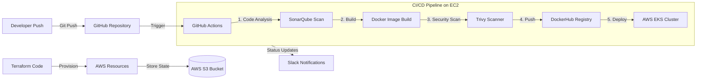

# CI/CD Pipeline Architecture

## Pipeline Overview

1. **Version Control**

   - Developers push code to GitHub repository
   - GitHub Actions triggered automatically on push

2. **CI/CD Pipeline**

   - Runs on AWS EC2 instance
   - SonarQube analyzes code quality
   - Docker image built and scanned with Trivy
   - Image pushed to DockerHub registry
   - Deployment to AWS EKS cluster

3. **Infrastructure**
   - AWS resources provisioned via Terraform
   - Terraform state stored in S3 bucket
   - Slack notifications for build status

